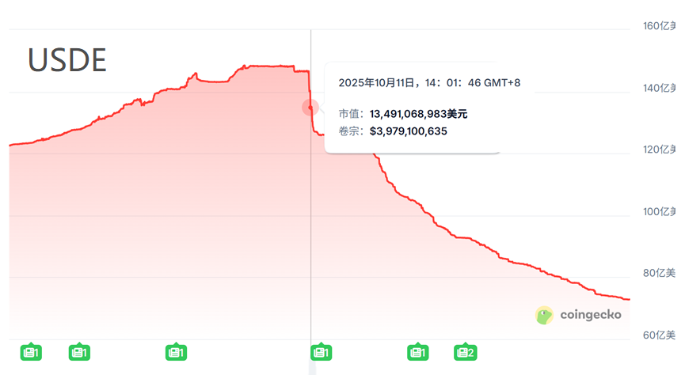
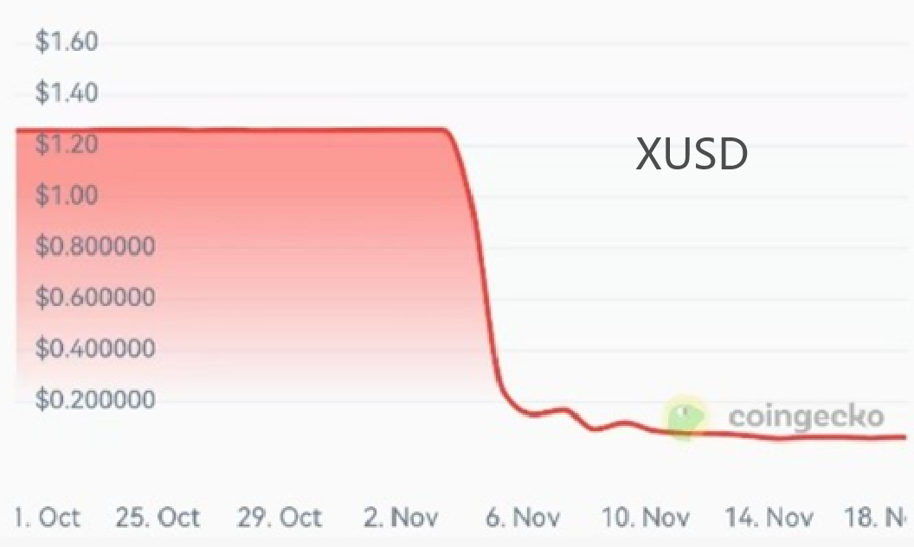
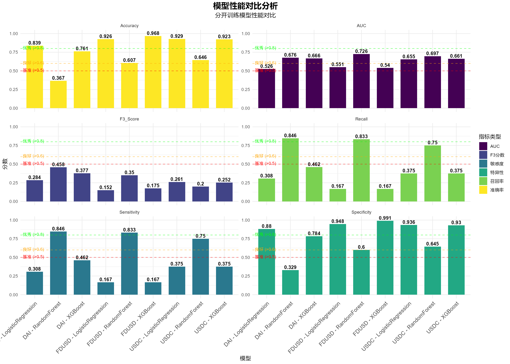

# 一、研究介绍

:::: nonincremental
## 1.1 研究意义

随着加密金融体系的快速扩张，稳定币已成长为加密生态的系统性重要节点。一旦发生脱锚事件，风险可能通过流动性枯竭、抵押资产价值下跌与市场信心崩塌等机制传导，引发系统性冲击。

然而，**TerraUSD（UST）崩盘、XUSD 脱锚**等事件表明，稳定币并非“天然稳定”，其价格锚定机制在极端市场环境下可能失效。

::: columns
{width="435"} {width="411"}
:::
::::

::: nonincremental
## 1.1 研究意义

我们发现，现有稳定币风险管理存在**风险暴露滞后、信息高度专业化且分散、缺乏个性化视角**等不足。

在此背景下，本项目提出构建 **AnchorWatch——稳定币脱锚风险智能监控与评估系统**，旨在通过可视化监控与个性化评估，将复杂的稳定币脱锚风险转化为直观、可操作的预警信号，帮助投资者与管理者在不确定的加密市场中做出更理性、更审慎的决策。

AnchorWatch 通过降低信息理解与风险识别门槛，为投资者构建一套可靠的风险监测与预警工具，从而降低其进入加密金融领域的认知成本与操作风险，赋能每一位市场参与者并在长期上助力稳定币生态的健康发展。
:::

::: nonincremental
## 1.2 预期成果

我们期望AnchorWatch可以实现四大核心功能：

-   **多源数据整合与实时监测**：可以自动化调用链上与市场 API，整合价格、交易量、链上活跃度、BTC 波动率等多维度数据。（实际项目以截至近日的历史数据为主）

-   **机器学习驱动的脱锚概率预测**：基于 R 语言环境，结合已有学术研究，利用逻辑回归、随机森林与 XGBoost 等模型构建预测框架，输出稳定币在未来短期内（24 小时）发生脱锚事件的预测概率，为风险预警提供量化依据。

-   **交互式可视化监管仪表盘**：基于 shiny 构建前端界面，结合 ggplot2 与 plotly，实现时间序列预测曲线、特征重要性图等可视化结果，并以直观的“红—黄—绿灯”形式呈现稳定币当前风险状态。

-   **个性化风险测算模块**：在这个模块中用户可输入自身持有的稳定币组合与资产总额，系统将结合市场风险数据，输出个体化的风险评分，并展示潜在损失，实现面向个人投资者的精细化风险管理。
:::

::: nonincremental
## 1.3 分工协作

-   **朱珂莹：**
    -   阅读文献，确定数据变量、脱锚指标与整体建模方向
    -   数据获取（除稳定币外的其他解释变量）、数据清洗与整理
    -   脱锚风险模型构建与模型调试
-   **叶宇捷：**
    -   阅读文献，确定数据变量与建模方向
    -   数据获取（稳定币与主要加密货币相关数据），并进行特征工程构建
    -   脱锚风险模型构建与调试，并进行后续模型修正
-   **李嘉悦：**
    -   负责开题报告
    -   阅读文献，参与确定数据变量与可视化指标
    -   负责 AnchorWatch Shiny App 的整体设计与部署
:::

# 二、数据获取与处理

::: nonincremental
## 2.1 **数据来源与获取方式**

本研究采用多源数据整合方法，构建了一个覆盖稳定币市场、加密货币市场、传统金融市场以及宏观与系统性风险指标的综合性数据集。最终用于建模的样本共包含 稳定币4111 条日度观测值，其中：

-   **USDC**：2529 条（从2019年1月1日到2025年12月4日 ）
-   **FDUSD**：862 条（从2023年7月26日2025年12月4日）
-   **DAI**：720 条（从2023年12月15日到2025年12月4日）
-   此外，**其他宏观与金融市场数据**：从2019年1月1日到2025年12月9日

其中，稳定币相关数据通过Binance、Kraken、OKX、KuCoin和CoinGecko的多网站API数据相互补充获取。
:::

::: nonincremental
## 2.2 被解释变量：脱锚事件

参考[**Carey (2023)**](Stablecoin%20depegging%20risk%20prediction.pdf)的研究结论，固定阈值方法可能无法充分反映不同稳定币在流动性水平与市场深度方面的差异。我们采用**动态阈值法**来定义“脱锚”事件。

\\\[ \\text{Thresh}\_D = 1 - \\frac{10}{\\sqrt\[3\]{V\_{\\text{monthly}}}} \\\] \\\[ \\text{Thresh}\_U = 1 + \\frac{10}{\\sqrt\[3\]{V\_{\\text{monthly}}}} \\\]

其中 $V_{\text{monthly}}$ 为滚动30天交易量总和。

若当日最低价 $P_L < \text{Thresh}_D$ 或最高价 $P_H \geq \text{Thresh}_U$，则标记为脱锚（$Y = 1$）。
:::

::: nonincremental
## 2.3 研究对象选择

-   选取**三种稳定币（USDC、FDUSD、DAI）**的**市场价格数据（包括开盘价、最高价、最低价、收盘价和交易量）**并对其进行特征工程处理，以下是我们具体的特征工程处理过程。

|  |  |  |  |  |
|-------|--------------|-------------------------------|-----------|-----------|
| 稳定币 | 类型 | 选择原因 | 脱锚次数 | 脱锚率 |
| USDC | 法币抵押型 | 市场份额大、监管透明度高、多次历史脱锚事件 | 144 | 5.69% |
| DAI | 加密货币抵押型 | 去中心化代表、超额抵押机制、价格波动性较高 | 36 | 4.99% |
| FDUSD | 新兴法币抵押型 | 2023年7月上线，代表新兴稳定币的市场行为与风险特征 | 76 | 8.81% |

-   特征维度：模型输入包含 66 个解释变量，输出为 1 个脱锚状态变量。
:::

::: nonincremental
## 2.4 研究对象特征工程

在此基础上，对于被解释变量与解释变量做了特征工程处理

| 类别     | 特征                                          | 作用        |
|----------|-----------------------------------------------|-------------|
| 基础价格 | 滞后特征：前1天、2天、3天的收盘价和交易量     | 近期惯性    |
|          | 价格变化：当日价格与前一日价格的百分比变化    | 单日涨跌    |
|          | 对数收益（ln(当日收盘价/前一日收盘价)）       | 标准化收益  |
| 趋势动量 | 移动平均线：7日和30日简单移动平均             | 短/中期趋势 |
|          | 价格与均线的关系：(收盘价/移动平均 - 1) × 100 | 相对强弱    |
|          | 动量指标：过去5天、10天、20天的价格变化率     | 加速度      |
:::

::: nonincremental
## 2.4 研究对象特征工程

| 类别 | 特征 | 作用 |
|----------|---------------------------------------------|---------------|
| 波动技术 | 波动率计算：7日和30日价格变化的标准差 | 短期/长期风险 |
|  | RSI相对强弱指数：14日周期 | 超买超卖 |
|  | 价格通道：20日最高价通道和最低价通道 | 压力/支撑 |
|  | 通道位置：(收盘价 - 通道最低价)/(通道最高价 - 通道最低价) | 区间定位 |
| 时间成交 | 时间特征：星期几、月份、是否周末 | 日历效应 |
|  | 交易量特征：交易量移动平均、交易量变化率 | 资金流动强度 |
|  | 交易量比率：当日交易量/6个月滚动中位数 | 标准化交易量 |
|  | 滚动交易量特征：30日滚动交易量及其变化 | 成交量趋势 |
:::

::: nonincremental
## 2.5 解释变量

数据来源基于已有文献中广泛使用的公开数据库与指标体系，包括66个特征：

| 类别 | 数据来源 | 具体指标 | 文献依据 |
|---------------|----------------|-----------------------|------------------|
| 抵押资产（美元）相关 | 美联储、iFinD、密歇根大学 | 美元指数，联邦基金利率，美国1年通胀预期，TED利差指数，美国贸易差额，美国2年期国债利率，美国10年期国债利率等 | Lyons & Viswanath-Natraj (2023) |
| 稳定币自身相关属性 | DeFiLlama API、Binance API（CEX）、Uniswap API（DEX）、MakerDAO API | 赎回量，DEX流动性池深度，CEX与DEX价格差等 | Baur & Hoang (2021) |
:::

::: nonincremental
## 2.5 解释变量

数据来源基于已有文献中广泛使用的公开数据库与指标体系，包括66个特征：

| 类别 | 数据来源 | 具体指标 | 文献依据 |
|---------------|----------------|--------------------------|---------------|
| 加密货币相关属性 | Binance API | BTC和ETH的价格、交易量与历史分位数等 | Ante et al. (2023) |
| 市场与风险指标 | 美国金融研究办公室、芝加哥期权交易所(CBOE)、iFinD | SP500、 NASDAQ、 Dow收盘价及波动率，VIX指数，地缘政治风险GPR指数，系统性金融压力指数（KCFSI, STLFSI），美国金融压力指数，Baker-Bloom-Davis经济政策不确定性指数等 | Lin et al. (2023) |
:::

::: nonincremental
## 2.6 训练集与测试集划分

|        |          |            |          |          |
|--------|----------|------------|----------|----------|
| USDC   | 数据行数 | 脱锚事件数 | 脱锚比例 | 用途     |
| 训练集 | 1896条   | 136次      | 7.17%    | 模型训练 |
| 测试集 | 633条    | 8次        | 1.26%    | 模型评估 |

|        |          |            |          |          |
|--------|----------|------------|----------|----------|
| DAI    | 数据行数 | 脱锚事件数 | 脱锚比例 | 用途     |
| 训练集 | 540条    | 23次       | 4.26%    | 模型训练 |
| 测试集 | 180条    | 13次       | 7.22%    | 模型评估 |

|        |          |            |          |          |
|--------|----------|------------|----------|----------|
| FDUSD  | 数据行数 | 脱锚事件数 | 脱锚比例 | 用途     |
| 训练集 | 646条    | 69次       | 10.68%   | 模型训练 |
| 测试集 | 216条    | 6次        | 2.78%    | 模型评估 |

-   **划分方法：**
-   时间序列分割：按时间顺序，前75%训练，后25%测试
-   避免数据泄露：严格遵守时间先后顺序
:::

# 三、模型选择与调试

## 3.1 模型选择与对比策略

::: nonincremental
-   我们选择了三种不同类型的机器学习模型进行对比：

-   **1.逻辑回归：** 作为基准线性模型，逻辑回归解释性强，不易过拟合，在特征线性可分的情况下表现良好，但是在极端不平衡数据上可能表现不稳定。

-   **2.随机森林：** 它作为一种集成学习方法，能很好处理非线性关系而且自带特征重要性评估，在特征工程充分的情况下应有较好的综合性能。

-   **3.XGBoost：** 是一种梯度提升算法，比较擅长处理结构化数据，具有正则化防止过拟合的优势，预测准确率较高到那时要小心过拟合。

|       |               |          |        |             |       |          |
|-------|---------------|----------|--------|-------------|-------|----------|
| Coin  | Model         | Accuracy | Recall | Specificity | AUC   | F3_Score |
| USDC  | Random Forest | 0.646    | 0.75   | 0.645       | 0.697 | 0.2      |
| FDUSD | Random Forest | 0.606    | 0.833  | 0.6         | 0.726 | 0.350    |
| DAI   | Random Forest | 0.367    | 0.846  | 0.329       | 0.676 | 0.458    |
:::

## 3.1 模型选择与对比策略

{fig-align="center" width="690"}

-   由于脱锚事件属于少数类且漏报风险代价高昂，模型需优先保障高召回率以减少实际风险遗漏，而随机森林由于其在不同稳定币数据集上表现出的均衡综合性能被选择。从模型效果对比数据来看：**XGBoost**和**逻辑回归**虽然常表现出高准确率，但两者对FDUSD召回率仅0.1667，导致脱锚事件漏报风险高。这意味着它们极易漏报真实的脱锚风险，而漏报在金融风险监控中是难以接受的代价。
-  相比之下，**随机森林**在召回率上显著占优，基本保持在0.75以上，且综合评分在三种稳定币数据上均持续领先，同时AUC值稳定在0.676以上，体现了在捕捉关键风险和整体稳健性上的最佳均衡。

## 3.2 样本不平衡问题的解决方案

::: nonincremental
-   在稳定币脱锚预测任务中明显存在正样本（脱锚）极少、代价敏感的问题，脱锚样本通常少于总样本的5%，造成了模型偏向多数类、评估指标失真且训练不稳定的问题。为解决严重的样本不平衡问题，我们参考相关论文采取算法、数据、模型训练的多层级解决法。
-   **算法层面**：使用F3分数作为评估指标，强调召回率的重要性，虽然没有显式设置代价矩阵，但通过F3分数隐式实现代价敏感学习。
-   **数据层面**：利用smote策略，根据论文建议将目标脱锚比例设定为60%，同时动态调整合成样本倍数。
-   **模型训练**：采取分层抽样、寻找最佳分割点的方式，确保训练集和测试集保持相似的类别分布，同时多次尝试找到训练集中有足够脱锚样本的分割点，在随机森林中通过sampsize参数控制各类别样本数。
:::

::: nonincremental
## 3.3 特征重要性分析

|                          |                |                |
|--------------------------|----------------|----------------|
| Feature                  | Avg_Importance | Std_Importance |
| price_volatility         | 5.054217       | 6.785065       |
| volatility_30d           | 4.40032        | 6.125663       |
| volatility_7d            | 3.89628        | 5.439595       |
| price_range              | 3.389878       | 4.685118       |
| high                     | 2.46799        | 3.435151       |
| volume_6m_rolling_median | 2.437492       | 3.438267       |
| channel_high_20          | 2.049599       | 2.871044       |
| momentum_20              | 1.938432       | 2.731051       |

从以上通过随机森林模型得到的特征重要性数据可以看出：最关键的特征分别是价格波动、中期波动率、短期波动率和价格范围。
:::

::: nonincremental
## 3.3 特征重要性分析

1.  **价格波动与范围：** 重要性最高且最具有业务意义的数据，因为价格波动范围直接反映市场的不稳定性，大幅的价格波动通常是脱锚的前兆。
2.  **短期波动率：** 居于次位，它具有强烈的预警作用，7天波动率可以迅速捕捉短期市场情绪变化，突然增加的短期波动可能预示着即将发生的脱锚事件。
3.  **中期波动率：** 反映中期市场稳定性，为我们的脱锚风险预测提供市场正常波动水平的基准，特别地某些月份（如年底流动性紧张时）脱锚风险更高，间接体现了宏观经济的影响，而最高价则是明显的价格压力指标，当价格接近或突破某些关键价位可能触发连锁反应。
:::

# 四、Anchor Watch

{width="882"}

::: nonincremental
-   **感谢您的耐心等待！**
:::